>[!CAUTION]
>For demo purposes only!
>Do not expect big graphs to be processed successfully (in reasonable time or without out-of-memory errors).

This demo is based on UCFS, which, for a given grammar represented as an RSM, a graph, and start vertices, produces an SPPF.

**RSM** (Recursive State Machine) is an automaton-like representation of context-free languages.

**SPPF** (Shared Packed Parse Forest) is a derivation-tree-like structure that represents **all** possible paths satisfying the specified grammar. If the number of such paths is infinite, the SPPF contains cycles.
SPPF consists of nodes of the types listed below. Each node has a unique Id and detailed information specific to its type.

* **Nonterminal** node contains the name of the non-terminal and pairs of vertices from the input graph that are the start and end of paths derived from that non-terminal.
  
  

  This node has number ```0``` and is the root of all derivations for all paths from 1 to 4 derivable from non-terminal ```S```

* **Terminal** node is a leaf and corresponds to an edge.

  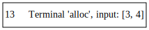

  This node depicts edge ```3 -alloc-> 4```.

* **Epsilon** node is a simplified way to represent that $\varepsilon$ is derived at a specific position.

  

* **Range** node is a supplementary node that helps reuse subtrees.
  
  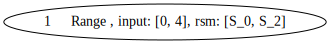

  This node represents all subpaths from 0 to 4 that are accepted while the RSM transitions from ```S_0``` to ```S_2```.

* **Intermediate** node is a supplementary node used to connect subpaths.

  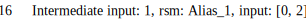

  This node depicts that the path from 0 to 2 is composed of two parts: from 0 to 1 and from 1 to 2.

**Requirements**: 11 java

**To run (from project root)**:

```bash
./gradlew :cfpq-app:run
```

**Input graphs:** ```src/main/resources/```

**Grammar and code for paths extraction:** ```src/main/kotlin/me/vkutuev/Main.kt```

>[!NOTE] 
> We implemented a very naive path extraction algorithm solely to demonstrate SPPF traversal.

## Examples

We provide a few code snippets, the corresponding graphs to be analyzed, parts of the resulting SPPFs, and extracted paths.

For analysis, we use the following extended points-to grammar (start non-terminal is ```S```), which allows us to analyze chains of fields.
```
PointsTo -> ("assign" | ("load_i" Alias "store_i"))* "alloc"
FlowsTo -> "alloc_r" ("assign_r" | ("store_i_r" Alias "load_o_r"))*
Alias -> PointsTo FlowsTo
S -> (Alias? "store_i")* PointsTo
```

For all our examples, we use a common grammar with $i \in [0..3]$.
The corresponding RSM is presented below:

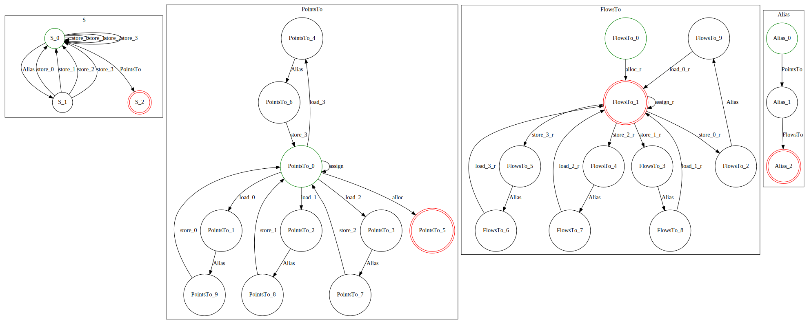

### Example 1
Code snippet: 
```java
val n = new X()
val y = new Y()
val z = new Z()
val l = n
val t = y
l.u = y
t.v = z
```

Respective graph:

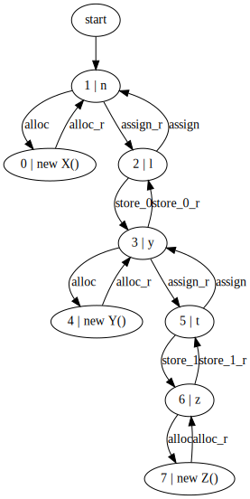

Resulting SPPF:

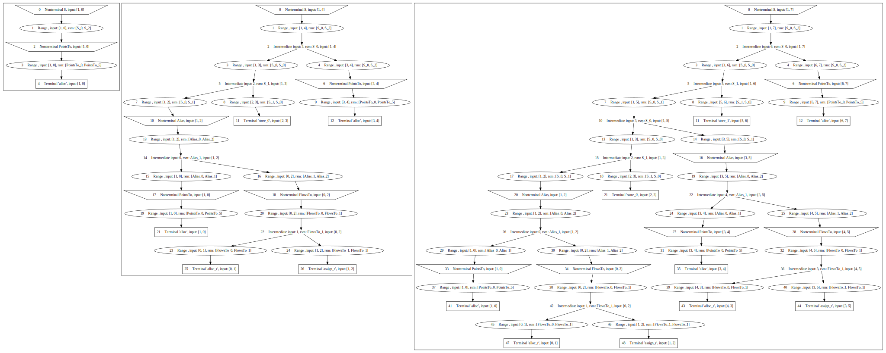

Three trees are extracted because there are three paths of interest from node 1.
We do not extract subpaths derivable from non-terminals ```Alias``` and ```PointsTo```, as they contain no useful information for restoring fields.


Respective paths:

* [(1-PointsTo->0)]
  
  This path is trivial. Such paths will be omitted in further examples.

* [(1-Alias->2), (2-store_0->3), (3-PointsTo->4)]

  This path means that ```n.u = new Y()```. Vertex 2 is an alias for 1 (corresponding to ```n```), and 2 has a field ```u``` that points to ```new Y()``` (```store_0``` corresponds to ```l.u = y```).

* [(1-Alias->2), (2-store_0->3), (3-Alias->5), (5-store_1->6), (6-PointsTo->7)]

  This path means that ```n.u.v = new Z()```. 
 

### Example 2

Code snippet: 
```java
val n = new X()
val l = n
while (...){    
    l.next = new X()
    l = l.next
}
```

Respective graph:

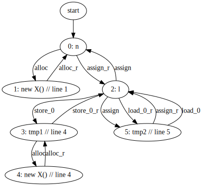

Part of resulting SPPF:

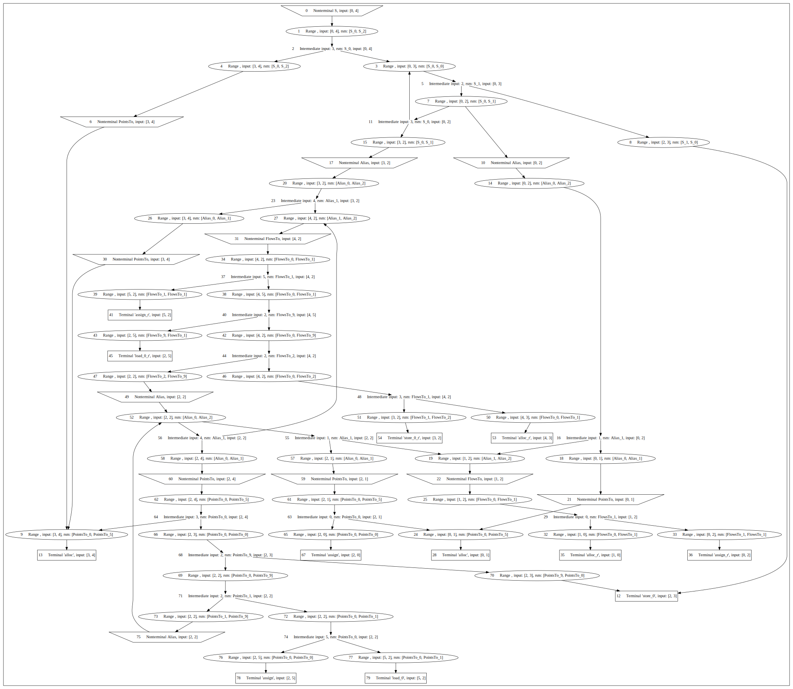

This part contains a cycle formed by vertices 27–31–34–37–38–40–42–44–47–49–52–56 (colored in red). This is because there are infinitely many paths of interest. We extract some of them:

* [(0-Alias->2), (2-store_0->3), (3-PointsTo->4)]

  ```n.next = new X () // line 4```

* [(0-Alias->2), (2-store_0->3), (3-Alias->2), (2-store_0->3), (3-PointsTo->4)]

  ```n.next.next = new X () // line 4```

* [(0-Alias->2), (2-store_0->3), (3-Alias->2), (2-store_0->3), (3-Alias->2), (2-store_0->3), (3-PointsTo->4)]

  ```n.next.next.next = new X () // line 4```

* [(0-Alias->2), (2-store_0->3), (3-Alias->2), (2-store_0->3), (3-Alias->2), (2-store_0->3), (3-Alias->2), (2-store_0->3), (3-PointsTo->4)]

  ```n.next.next.next.next = new X () // line 4```

* [(0-Alias->2), (2-store_0->3), (3-Alias->2), (2-store_0->3), (3-Alias->2), (2-store_0->3), (3-Alias->2), (2-store_0->3), (3-Alias->2), (2-store_0->3), (3-PointsTo->4)]

  ```n.next.next.next.next.next = new X () // line 4```

* [(0-Alias->2), (2-store_0->3), (3-Alias->2), (2-store_0->3), (3-Alias->2), (2-store_0->3), (3-Alias->2), (2-store_0->3), (3-Alias->2), (2-store_0->3), (3-Alias->2), (2-store_0->3), (3-PointsTo->4)]

  ```n.next.next.next.next.next.next = new X () // line 4```

More paths can be extracted if needed. Traversal should be tuned accordingly.

### Example 3

Code snippet:
```java
val n = new X()
val l = n
while (...){
    val t = new X()
    l.next = t
    l = t
}
```

Respective graph:

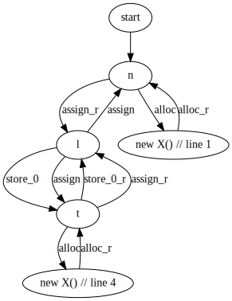

Part of resulting SPPF:

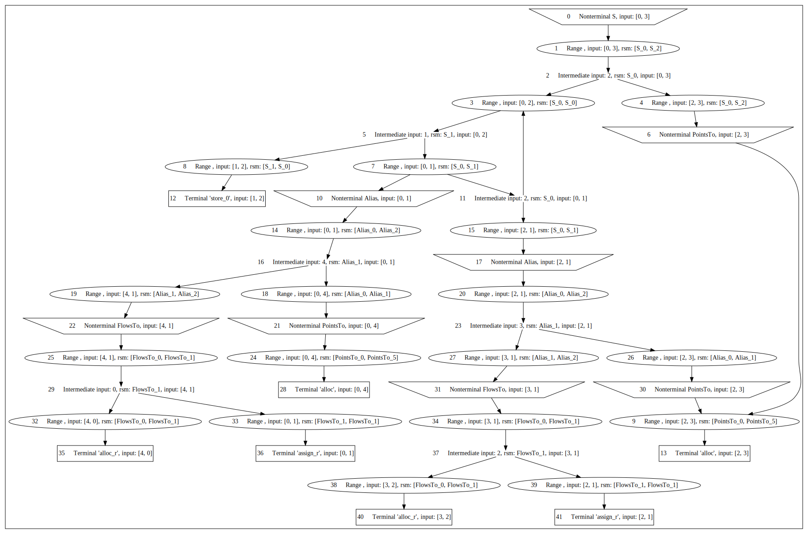

This SPPF also contains a cycle (3–5–7–11), so there are infinitely many paths of interest, and we extract only a few of them.

* [(0-Alias->1), (1-store_0->2), (2-PointsTo->3)]

  ```n.next = new X() // line 4```

* [(0-Alias->1), (1-store_0->2), (2-Alias->1), (1-store_0->2), (2-PointsTo->3)]

  ```n.next.next = new X() // line 4```

* [(0-Alias->1), (1-store_0->2), (2-Alias->1), (1-store_0->2), (2-Alias->1), (1-store_0->2), (2-PointsTo->3)]

  ```n.next.next.next = new X() // line 4```

* [(0-Alias->1), (1-store_0->2), (2-Alias->1), (1-store_0->2), (2-Alias->1), (1-store_0->2), (2-Alias->1), (1-store_0->2), (2-PointsTo->3)]

  ```n.next.next.next.next = new X() // line 4```

* [(0-Alias->1), (1-store_0->2), (2-Alias->1), (1-store_0->2), (2-Alias->1), (1-store_0->2), (2-Alias->1), (1-store_0->2), (2-Alias->1), (1-store_0->2), (2-PointsTo->3)]

  ```n.next.next.next.next.next = new X() // line 4```

* [(0-Alias->1), (1-store_0->2), (2-Alias->1), (1-store_0->2), (2-Alias->1), (1-store_0->2), (2-Alias->1), (1-store_0->2), (2-Alias->1), (1-store_0->2), (2-Alias->1), (1-store_0->2), (2-PointsTo->3)]

  ```n.next.next.next.next.next.next = new X() // line 4```


### Example 4

Code snippet:

```java
val n = new X()
val z = new Z()
val u = new U()
z.x = n
u.y = n
val v = z.x
v.p = new Y()
val r = u.y
r.q = new P()
```
Respective graph:

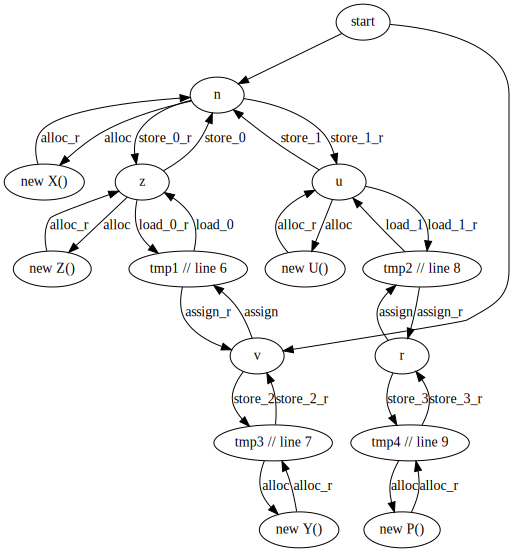

For this example, we omit the figure of the SPPF due to its size. However, we present the respective paths. Note that in this example, we specify two vertices as start: 1 and 8.

* [(1-Alias->9), (9-store_3->11), (11-PointsTo->13)]

  ```n.q = new P()```

* [(1-Alias->8), (8-store_2->10), (10-PointsTo->12)]

  ```n.p = new Y() ```

* [(8-Alias->9), (9-store_3->11), (11-PointsTo->13)]

  ```v.q = new P() ```

* [(8-store_2->10), (10-PointsTo->12)]

  ```v.p = new Y() ```

* [(8-Alias->8), (8-store_2->10), (10-PointsTo->12)]

  ```v.p = new Y() ```
